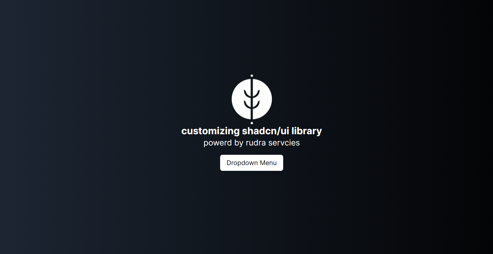

# Customizing shadcn/ui Library for Rudra Company

This guide will walk you through the steps to customize the shadcn/ui library to fit the design and functionality requirements of Rudra Company.

## Table of Contents

- [Customizing shadcn/ui Library for Rudra Company](#customizing-shadcnui-library-for-rudra-company)
  - [Table of Contents](#table-of-contents)
  - [Introduction](#introduction)
  - [Installation](#installation)

## Introduction

The shadcn/ui library is a powerful and flexible UI component library. By customizing it, you can ensure that the components align with Rudra Company's branding and design guidelines.

## Installation

To get started, you need to install the shadcn/ui library in your project. You can do this using npm or yarn:
